# Resume Interview Coach

An AI-powered web application that helps job seekers evaluate their resumes against job descriptions and practice interview responses with voice interaction.

## Features

### Function 1: Resume Evaluation
- Upload resume (PDF or DOCX)
- Paste job description
- Get initial AI evaluation with score (1-10), strengths, and gaps
- Answer up to 5 clarifying questions about transferable skills and upskilling
- Receive final evaluation with updated assessment

### Function 2: Interview Practice
- 20 AI-generated interview questions in 4 categories:
  - Hiring Manager - Typical (5 questions)
  - Hiring Manager - Challenging (5 questions)
  - HR - Typical (5 questions)
  - HR - Challenging (5 questions)
- Text-to-speech question delivery (ElevenLabs)
- Voice recording for responses
- Speech-to-text transcription (OpenAI Whisper)
- AI feedback on each response
- Retry until satisfactory

### Additional Features
- Conversation history
- Professional UI/UX with loading states
- Responsive design
- Audio playback for all attempts

## Tech Stack

- **Frontend/Backend**: Next.js 15 (App Router) with TypeScript
- **Database**: SQLite with Prisma ORM
- **Styling**: Tailwind CSS (v4)
- **LLM**: OpenAI API (configurable model)
- **Voice**: ElevenLabs (text-to-speech) + OpenAI Whisper (speech-to-text)
- **Document Processing**: pdf-parse (PDF) + mammoth (DOCX)

## Setup Instructions

### 1. Prerequisites

- Node.js 18+ installed
- OpenAI API key
- ElevenLabs API key

### 2. Installation

```bash
# Install dependencies
npm install

# Generate Prisma client
npx prisma generate

# Create and sync database
npx prisma db push
```

### 3. Environment Configuration

Copy `.env.example` to `.env.local` and fill in your API keys:

```bash
cp .env.example .env.local
```

Edit `.env.local`:

```env
OPENAI_API_KEY=your_openai_api_key_here
OPENAI_MODEL=gpt-4o
ELEVENLABS_API_KEY=your_elevenlabs_api_key_here
ELEVENLABS_VOICE_ID=your_voice_id_here
DATABASE_URL=file:./dev.db
```

**Getting API Keys:**

- **OpenAI**: Sign up at https://platform.openai.com/ and create an API key
- **ElevenLabs**: Sign up at https://elevenlabs.io/ and get your API key and voice ID from the dashboard

**Changing the Model:**

To use a different OpenAI model, change the `OPENAI_MODEL` value in `.env.local`:
- `gpt-4o` (default, most capable)
- `gpt-4o-mini` (faster, cheaper)
- `gpt-3.5-turbo` (cheapest)

### 4. Run the Application

```bash
npm run dev
```

Open [http://localhost:3000](http://localhost:3000) in your browser.

## Usage

### Creating a New Conversation

1. Click "New Conversation" on the home page
2. Upload your resume (PDF or DOCX)
3. Paste the job description
4. Click "Start Evaluation"

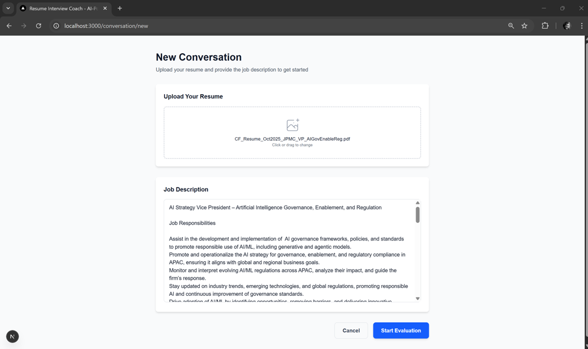

### Evaluation Flow

1. **Initial Evaluation**: Review your score, strengths, and gaps
2. **Clarifying Questions**: Answer questions about hidden skills (optional)
3. **Final Evaluation**: Get updated assessment
4. **Proceed to Interview Practice**

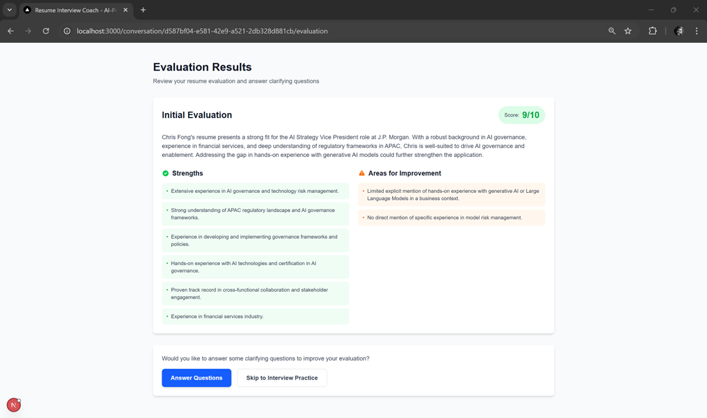

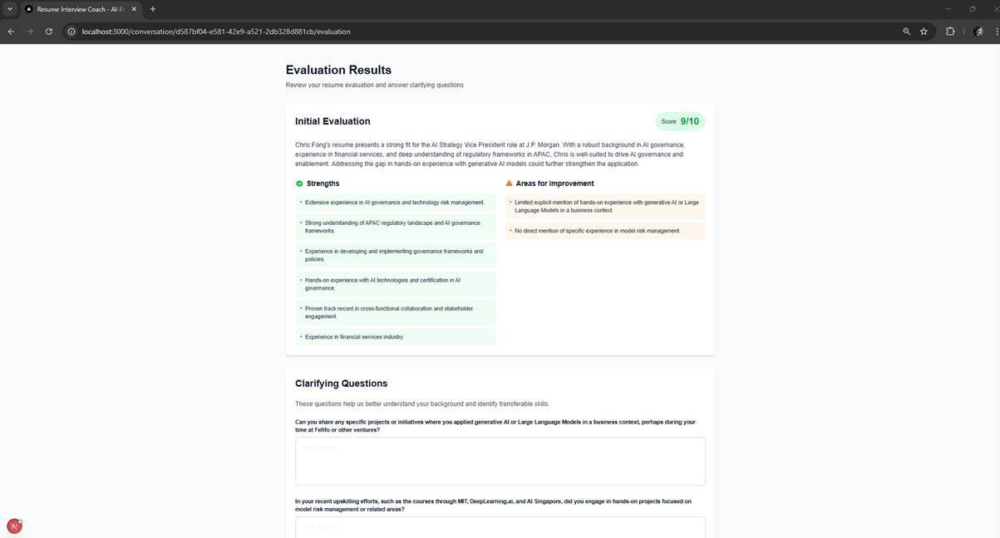

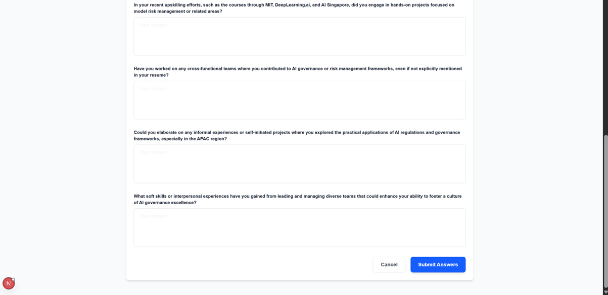


### Interview Practice

1. Select a question category
2. Click to play the question (text-to-speech)
3. Click the microphone to record your answer
4. Receive AI feedback
5. Retry if needed or move to next question

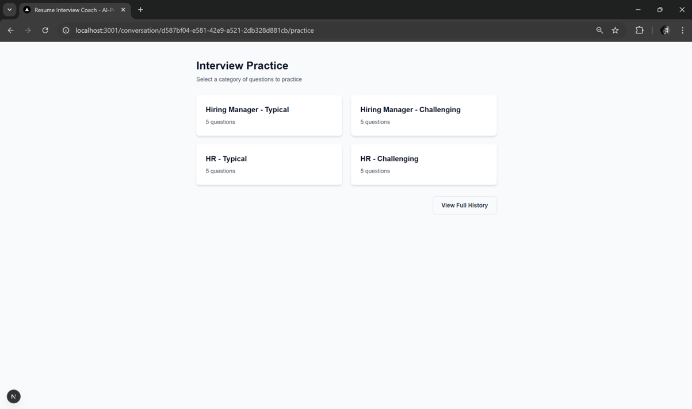

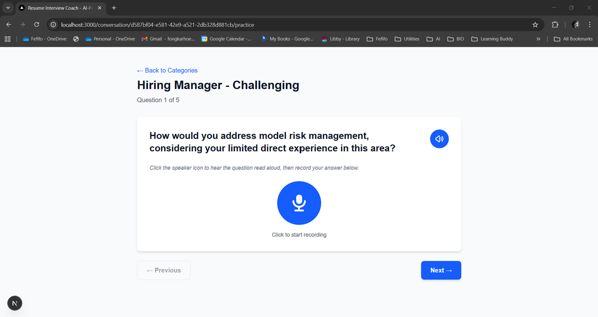

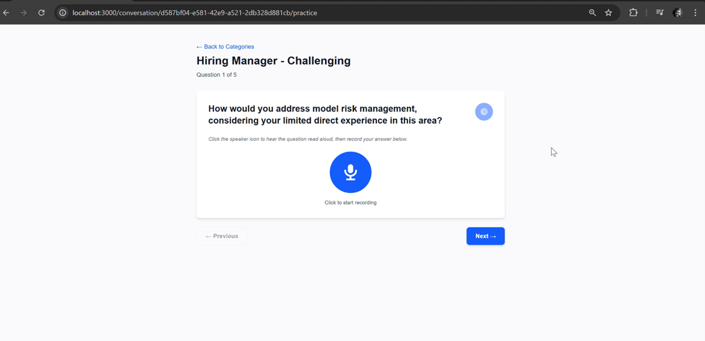

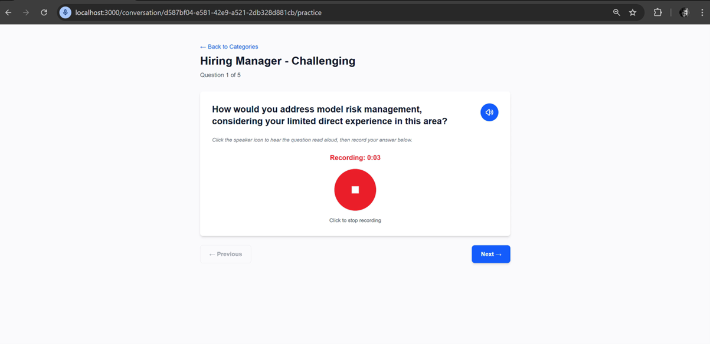

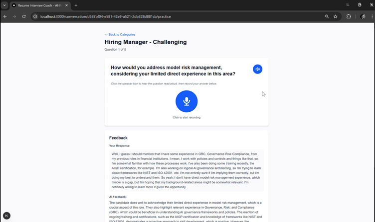

### Viewing History

- Click on any conversation card from the home page
- View resume, job description, evaluations, Q&A, and all practice attempts
- Play back your recorded responses

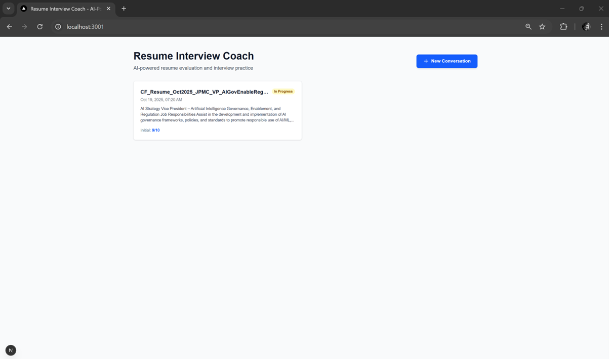

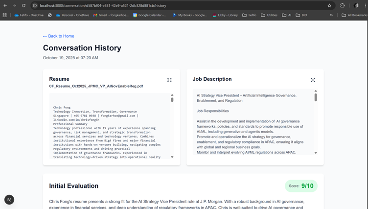

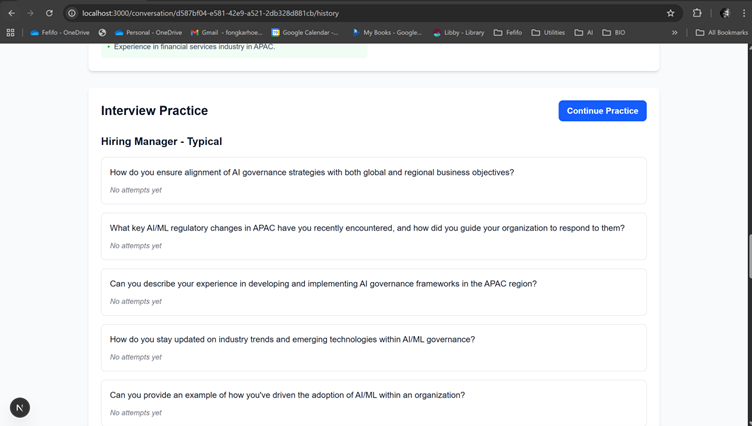

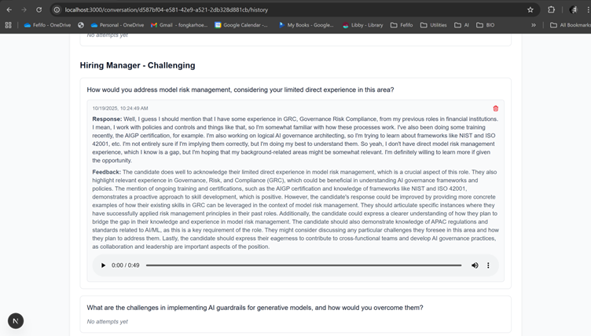

## Project Structure

```
├── app/
│   ├── api/                    # API routes
│   │   ├── conversations/      # CRUD for conversations
│   │   ├── upload/            # Resume upload & parsing
│   │   ├── evaluate/          # Initial evaluation
│   │   ├── clarify/           # Final evaluation
│   │   ├── generate-questions/# Generate interview questions
│   │   ├── tts/               # Text-to-speech
│   │   ├── stt/               # Speech-to-text
│   │   └── feedback/          # Evaluate responses
│   ├── components/            # Reusable UI components
│   ├── conversation/          # Conversation pages
│   │   ├── new/              # Create conversation
│   │   └── [id]/
│   │       ├── evaluation/   # Evaluation results
│   │       ├── practice/     # Interview practice
│   │       └── history/      # Full conversation history
│   ├── layout.tsx            # Root layout
│   └── page.tsx              # Home page
├── lib/
│   ├── prisma.ts             # Prisma client
│   ├── openai.ts             # OpenAI integration
│   ├── elevenlabs.ts         # ElevenLabs integration
│   └── documentParser.ts     # PDF/DOCX parsing
├── prisma/
│   └── schema.prisma         # Database schema
└── public/
    └── audio/                # Stored audio files
```

## Database Schema

- **Conversation**: Stores resume, job description, evaluations, and Q&A
- **Question**: Generated interview questions linked to conversations
- **Attempt**: User's practice attempts with audio, transcription, and feedback

## Troubleshooting

### Database Issues

```bash
# Reset database
rm prisma/dev.db
npx prisma db push
```

### API Rate Limits

If you hit rate limits:
- Use a cheaper model (gpt-4o-mini or gpt-3.5-turbo)
- Implement request caching (TTS is already cached)
- Add delays between requests

### Audio Issues

- Ensure microphone permissions are granted in browser
- Check that audio files are being saved to `public/audio/`
- Verify ElevenLabs API key and voice ID are correct

## Future Enhancements

- User authentication
- Saving questions and responses to favourites
- Multiple resume management
- Export reports as PDF
- Compare multiple job applications
- Custom question creation
- Progress tracking and analytics
- Mobile app version

## Customizing Resume Interview Coach Settings

The application offers extensive customization options to tailor the experience to your needs. You can:

- **Change OpenAI Models**: Switch between `gpt-4o`, `gpt-4o-mini`, or `gpt-3.5-turbo` to balance quality and cost
- **Customize Voice**: Select different ElevenLabs voices or use your own cloned voice
- **Adjust Model Parameters**: Fine-tune temperature, max tokens, and other LLM settings
- **Modify Prompts**: Customize evaluation criteria and question generation prompts
- **Configure Database**: Change storage location or switch database providers
- **Tune Performance**: Optimize for speed or cost reduction
- **Customize UI**: Change colors, fonts, and styling

For detailed instructions on all customization options, see **[CONFIGURATION.md](CONFIGURATION.md)**.

## License

MIT

## Support

For issues or questions, please open an issue on the repository.
